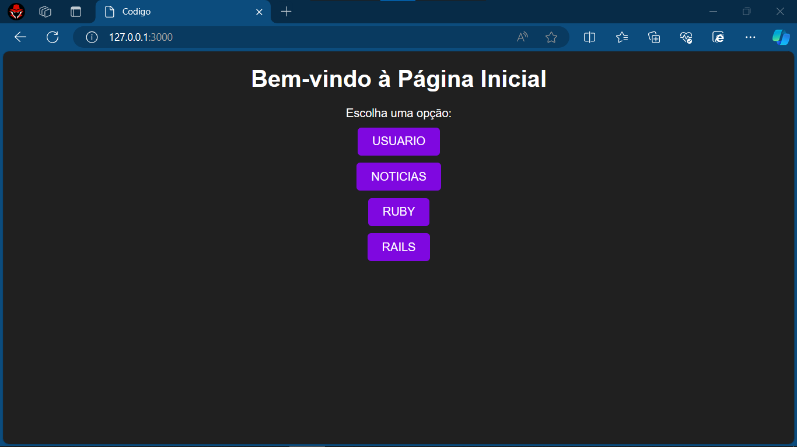
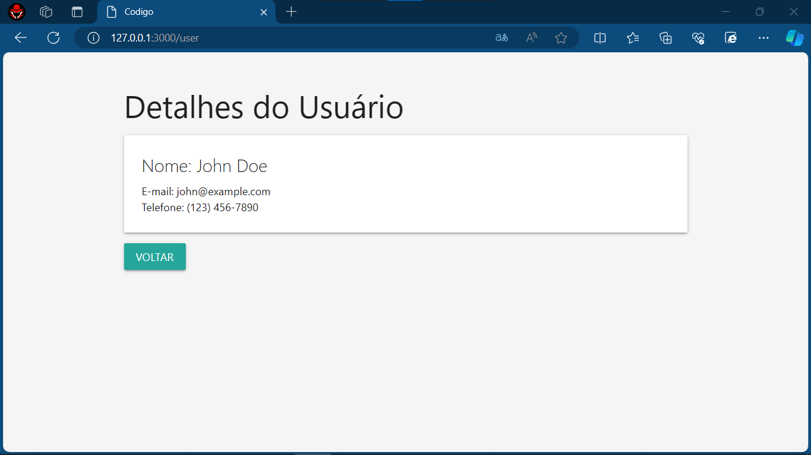
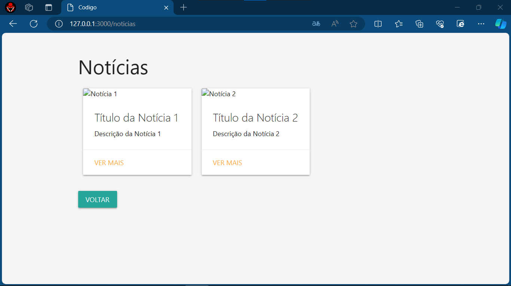
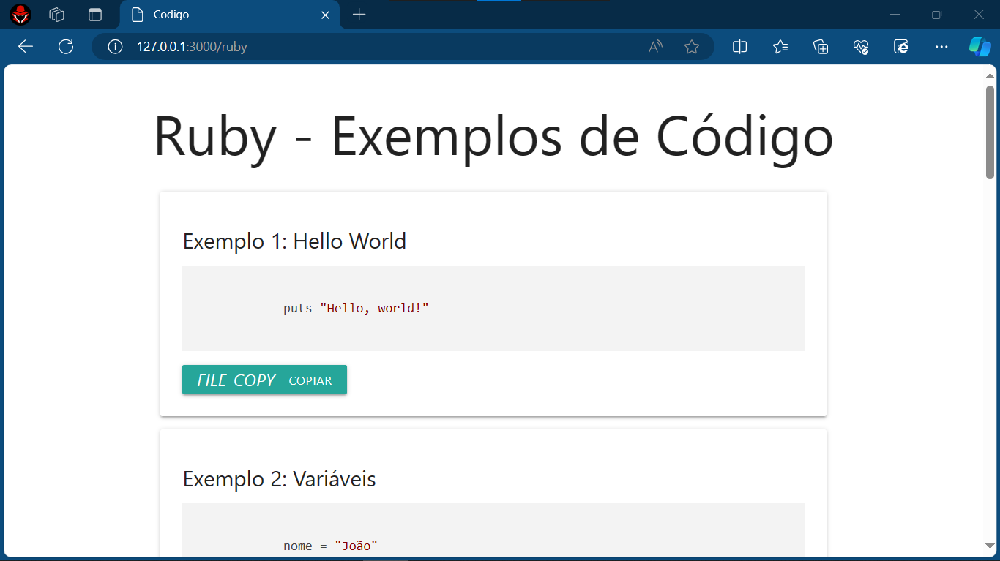
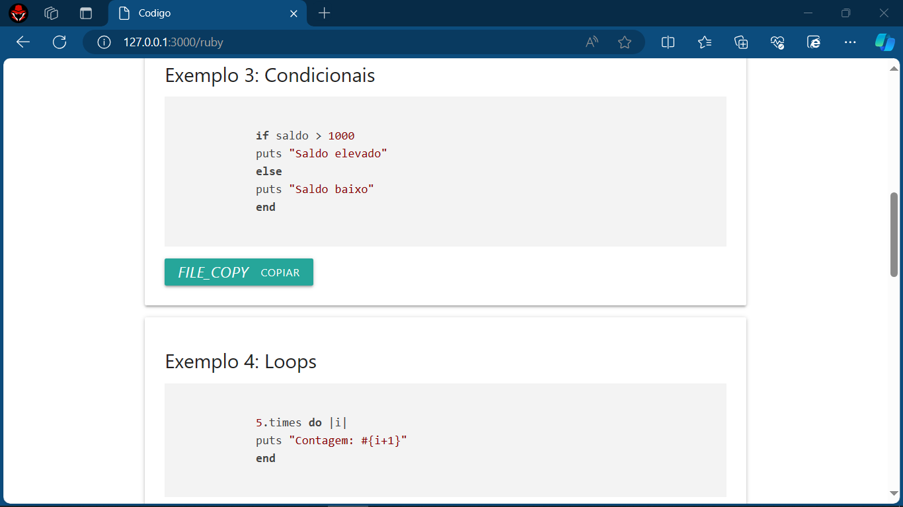
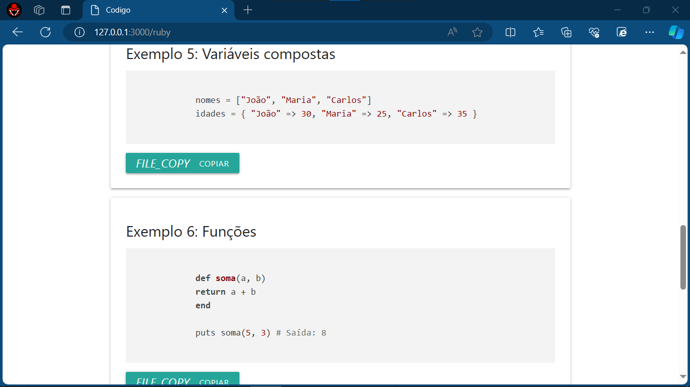
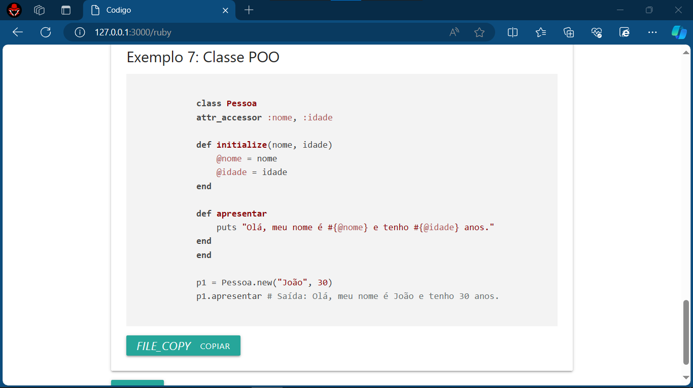
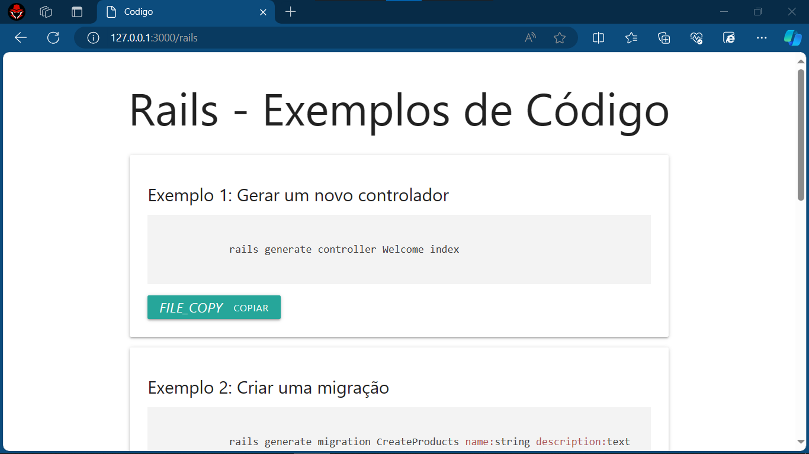
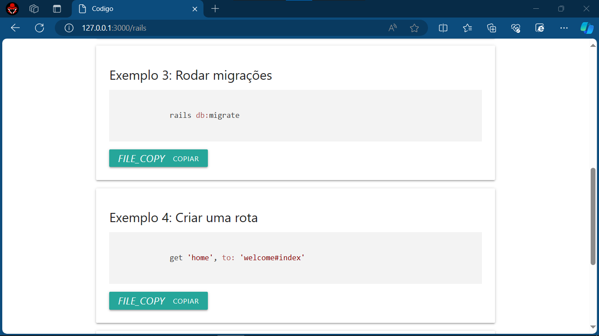
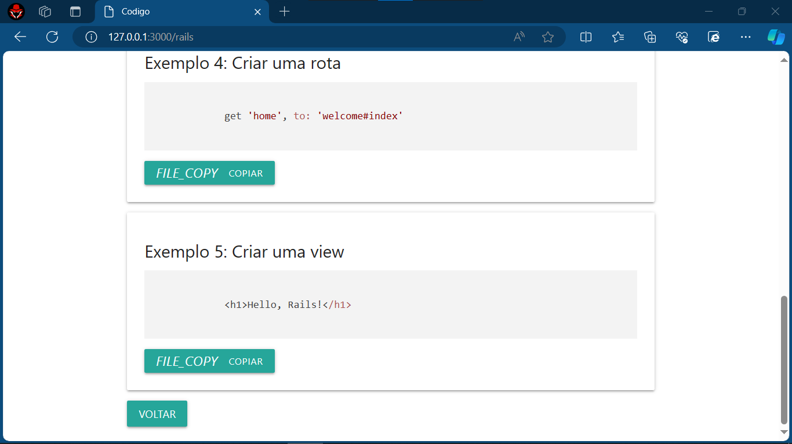

# ROTAS COM RAILS 
👨‍💻APP DE ROTAS COM RUBY ON RAILS E MATERIALIZECSS.

 <br>
 <br>
 <br>
 <br>
 <br>
 <br>
 <br>
 <br>
 <br>
 <br>

## DESCRIÇÃO:
`ROTAS COM RAILS` é uma aplicação web desenvolvida com o framework Ruby on Rails. Ela fornece várias páginas com exemplos de código e recursos úteis para aprender e praticar Ruby on Rails.

## PAGINAS:
1. **Home (/):** Apresenta uma breve introdução ao aplicativo e links (Botões) para outras páginas.
2. **Usuário (/user):** Apresenta informações sobre usuários (No formato estático).
3. **Notícias (/noticias):** Exibe notícias relacionadas ao mundo do desenvolvimento web, com a possibilidade de adicionar novas notícias.
4. **Ruby (/ruby):** Fornece informações sobre a linguagem de programação Ruby, juntamente com exemplos de código destacados.
5. **Rails (/rails):** Apresenta exemplos de código e conceitos relacionados ao framework Ruby on Rails.

## EXECUTANDO O PROJETO:
1. **Instalação das Dependências:**
   Antes de executar o aplicativo, certifique-se de instalar as dependências do projeto. No terminal, navegue até o diretório `./CODIGO` e execute o comando abaixo para instalar as dependências necessárias:
   ```bash
   bundle install
   ```

2. **Subindo o servidor:**
   Após instalar as dependências, ainda no terminal e no mesmo diretório (`./CODIGO`), execute o seguinte comando para iniciar o aplicativo:

  **LINUX/MACOS:**
   ```
   bin/rails server
   ```

   **WINDOWS:**
   ```
   ruby bin\rails server
   ```

3. **Acesso à Aplicação:** 
   Após iniciar o servidor Rails localmente, você pode acessar a aplicação através do navegador digitando [http://localhost:3000](http://localhost:3000).

4. **Navegação:** 
   Na página inicial, você encontrará links para as diferentes seções do aplicativo. Clique em um link (Botão) para acessar a página desejada.

5. **Exploração de Páginas:** 
   Cada página contém exemplos de código destacados relacionados ao tópico específico (/ruby e /rails). Você pode copiar esses exemplos de código clicando no botão "Copiar" próximo a cada exemplo.

5. **Retorno à Página Inicial:** 
   Para retornar à página inicial a qualquer momento, clique no botão "Voltar" localizado na parte inferior da página.

## NÃO SABE?
- Entendemos que para manipular arquivos em muitas linguagens, é necessário possuir conhecimento nessas áreas. Para auxiliar nesse aprendizado, oferecemos alguns cursos disponíveis:
* [CURSO DE RUBY ON RAILS](https://github.com/VILHALVA/CURSO-DE-RUBY-ON-RAILS)
* [CURSO DE MATERIALIZECSS](https://github.com/VILHALVA/CURSO-DE-MATERIALIZECSS)
* [CONFIRA MAIS CURSOS](https://github.com/VILHALVA?tab=repositories&q=+topic:CURSO)

## CREDITOS:
- [PROJETO CRIADO PELO VILHALVA](https://github.com/VILHALVA)


